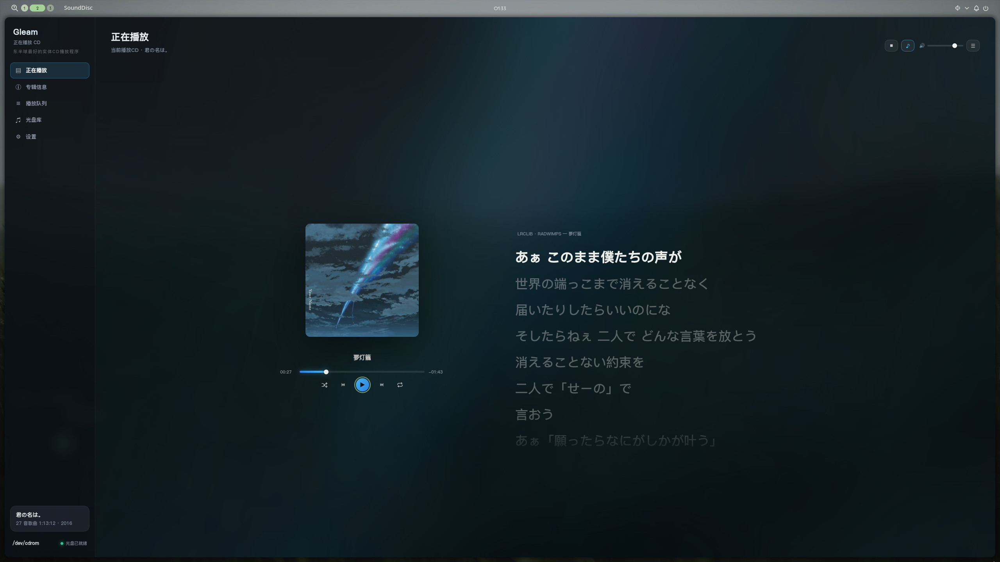
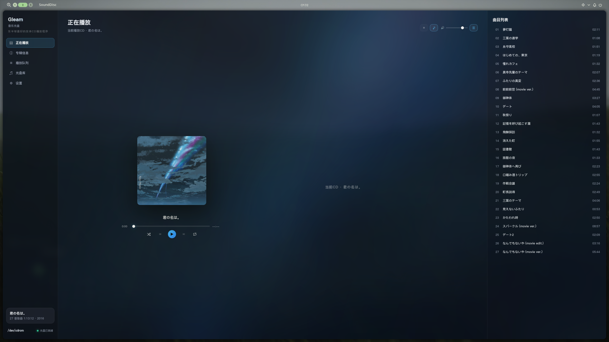

# Gleam

**English** | [简体中文](README.zh.md)

An offline CD player for the Linux desktop.

Gleam is a local CD player built with Tauri 2, React and libmpv.

Insert a CD: Gleam reads the disc's TOC, looks up album information on MusicBrainz by DiscID, then fetches cover art and lyrics. Recognized albums are saved to a local library, so the next time you insert the same disc, everything is loaded straight from the local data.

Playback is handled by libmpv, integrated directly into the app — no external mpv window or separate player is needed.

## Screenshots

**Now playing · synced lyrics**

Lyrics are sourced from LRCLIB, with synced scrolling and click-to-seek.



**Now playing · track list**

The TOC is read right after insertion, so you can see all tracks before the online lookup even finishes.



## Features

### CD playback

- TOC is read immediately after inserting a CD, tracks show up fast
- Disc info is read through Linux ioctl
- Plays through libmpv — no separate player process is started
- Play, pause, resume, seeking and volume control
- Previous / next track
- Shuffle
- Repeat one / repeat all
- Auto-advance to the next track
- Now-playing view shows cover art, track list and synced lyrics
- Ambient background effect derived from the cover art

### Disc recognition

- CD identification via MusicBrainz DiscID
- Fallback search by artist and album name when the DiscID isn't known
- One-click submission of the current DiscID to MusicBrainz
- Barcode used as a secondary check to confirm the exact release

### Local disc library

Recognized CDs are saved to a local library automatically.

The library is fully local — no need to hit the network every time you open the app.

What you can do:

- Save the mapping between a CD and its MusicBrainz release
- Override the album title and artist
- Upload or replace cover art from local files
- Re-fetch cover art
- Remove entries from the library
- Multi-disc sets: record Disc 1 / Disc 2 separately

Library cards have subtle hover/entry animations, and clicking a card opens the release on MusicBrainz.

### Lyrics

Lyrics come from two sources:

- LRCLIB
- NetEase Cloud Music

LRCLIB is tried first, matching by track name, duration and more. If that misses, NetEase is used.

What you get:

- Synced lyrics
- Current line highlighting
- Click a line to seek to that point
- Translation lines
- Manual re-search when a lookup fails
- Caching

To avoid wrong matches, lookups are validated beyond a plain name search.

### Appearance

Some basic personalization options:

- App font (picks from any font on your system)
- Text size (scales the text only, layout is untouched)
- Accent color
- Background light effect on/off

The UI is dark, glassy and restrained with its animation.

## Tech stack

| Part | Tech |
|---|---|
| Desktop shell | Tauri 2 / Rust |
| Frontend | React + TypeScript + Vite |
| Playback | libmpv |
| CD reading | Linux ioctl |
| DiscID | Own MusicBrainz DiscID implementation |
| Album metadata | MusicBrainz API |
| Lyrics | LRCLIB / NetEase Cloud Music |
| Cover art | Cover Art Archive / NetEase CDN |
| Storage | Local cache |

### About DiscID

The DiscID calculation follows the MusicBrainz algorithm and has been validated against the official example.

### About playback

libmpv is linked in-process through FFI — no separate mpv process is spawned. Playback and UI are both fully controlled by Gleam itself.

## Getting started

First off: Gleam is **Linux only**.

CD reading relies on Linux ioctl interfaces, so Windows and macOS are unsupported for now.

### 1. Install dependencies

Package names differ between distros; install what your system provides.

**Arch / CachyOS:**

```bash
sudo pacman -S webkit2gtk-4.1 mpv base-devel nodejs npm
```

**Debian / Ubuntu:**

```bash
sudo apt install build-essential curl wget file libssl-dev \
  libwebkit2gtk-4.1-dev libgtk-3-dev librsvg2-dev \
  libayatana-appindicator3-dev libmpv2 mpv nodejs npm
```

`libmpv` and `webkit2gtk-4.1` are required — audio is played through mpv, and Tauri runs the UI on WebKitGTK. Without them the build will not even start.

### 2. Install Rust and Node.js

Rust — use rustup, the recommended installer:

```bash
curl --proto '=https' --tlsv1.2 -sSf https://sh.rustup.rs | sh
```

Node.js 18 or newer. If your distro's version is too old, use nvm.

### 3. Get the project

```bash
git clone https://github.com/ocarinal/gleam.git
cd gleam
npm install
```

### 4. Run

Development mode:

```bash
npm run tauri dev
```

The first run compiles all Rust dependencies and can take a few minutes. If the terminal goes quiet for a while, it's probably still compiling — leave it alone.

To build a release:

```bash
npm run tauri build
```

The binary can then be run directly:

```bash
./src-tauri/target/release/sounddisc
```

.deb and .rpm packages are produced as well. For an AppImage, install fuse2 additionally.

### 5. First-run issues

**No permission to read the drive**

If the app cannot read the CD, add your user to the optical group:

```bash
sudo usermod -aG optical $USER
```

Then log out and back in.

**Cover art fails to download**

Cover art is fetched from Cover Art Archive first. If that's unreachable from your network, Gleam falls back to NetEase's cover source.

**Using a proxy**

If your network needs a proxy, just set the environment variables. Example:

```bash
https_proxy=http://127.0.0.1:7890 npm run tauri dev
```

Recognition, lyrics and cover art requests all go through it.

Insert a CD when you're ready: Gleam will recognize the album, fetch cover art and lyrics, and add it to your local library automatically.

## License

MIT. Metadata/lyrics/cover art come from [MusicBrainz](https://musicbrainz.org) / [LRCLIB](https://lrclib.net) / NetEase Cloud Music (for personal use only — please respect their terms of service).
